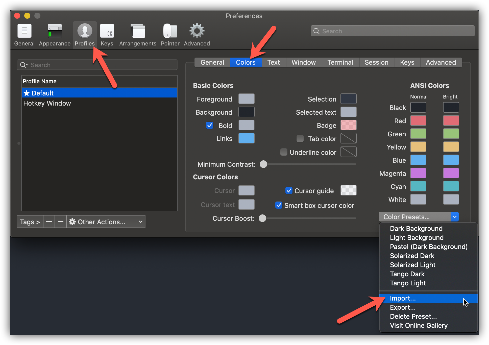
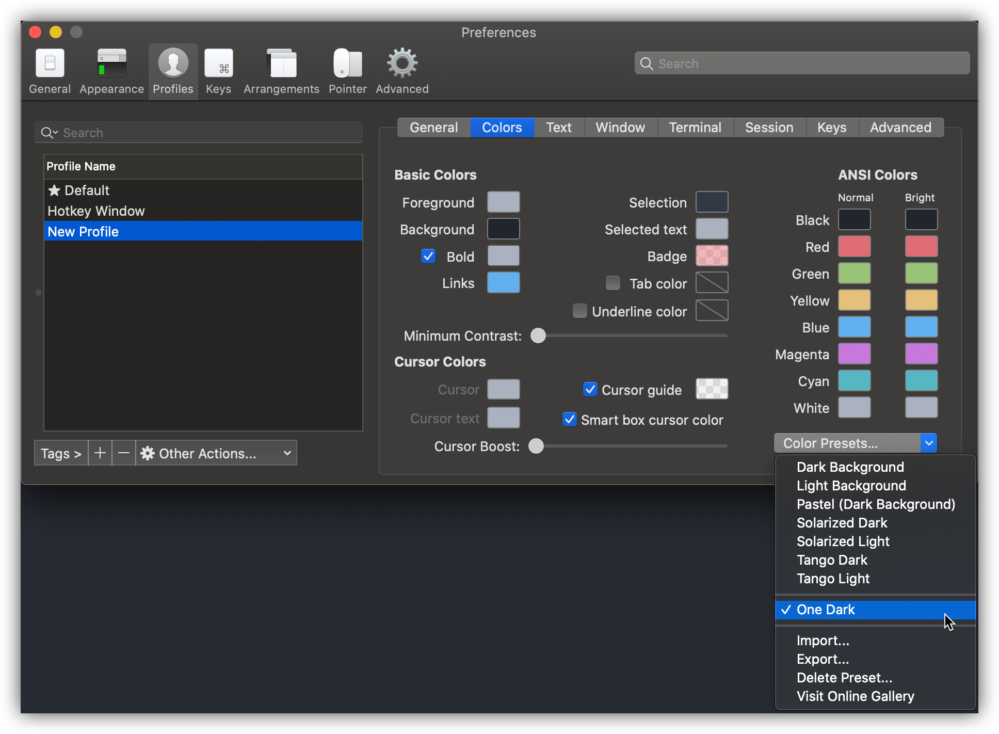

# iTerm2 One Dark Theme

> [One Dark](https://github.com/atom/one-dark-syntax) theme for iTerm2.

## Installation 📥

First, download the [One Dark.itermcolors](https://raw.githubusercontent.com/one-dark/iterm-one-dark-theme/master/One%20Dark.itermcolors) file. If your browser adds the `.txt` extension after downloading, rename the file so it uses the `.itermcolors` extension.

After downloading the file, open the iTerm settings and go to `Profiles > Colors`. Then, select the `Import...` option from the `Color Presets...` dropdown.

When prompted, select the `One Dark.itermcolors` file you just downloaded. This will import the One Dark preset for use. Finally, click `Color Presets...` and select `One Dark` from the list to enable the One Dark color theme for iTerm!

